# OAuth 2.0 Flow Diagrams

This document provides visual representations of the OAuth 2.0 flows supported by this authorization server.

## Table of Contents

- [Request Routing (Multi-Tenant)](#request-routing-multi-tenant)
- [Authorization Code Flow with PKCE](#authorization-code-flow-with-pkce)
- [Client Credentials Flow](#client-credentials-flow)
- [Refresh Token Flow](#refresh-token-flow)
- [Device Authorization Flow](#device-authorization-flow)
- [Token Introspection](#token-introspection)
- [Token Revocation](#token-revocation)

---

## Request Routing (Multi-Tenant)

All requests are routed through tenant-specific paths. The tenant resolver middleware extracts and validates the tenant before processing any OAuth request.

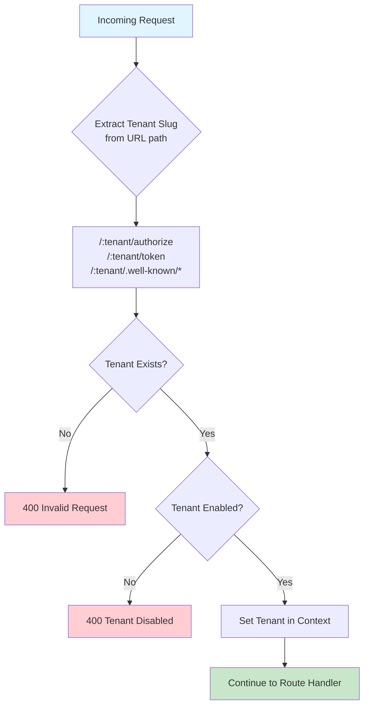

---

## Authorization Code Flow with PKCE

The recommended flow for web applications and native apps. PKCE (Proof Key for Code Exchange) is required for all authorization code requests per RFC 9700.

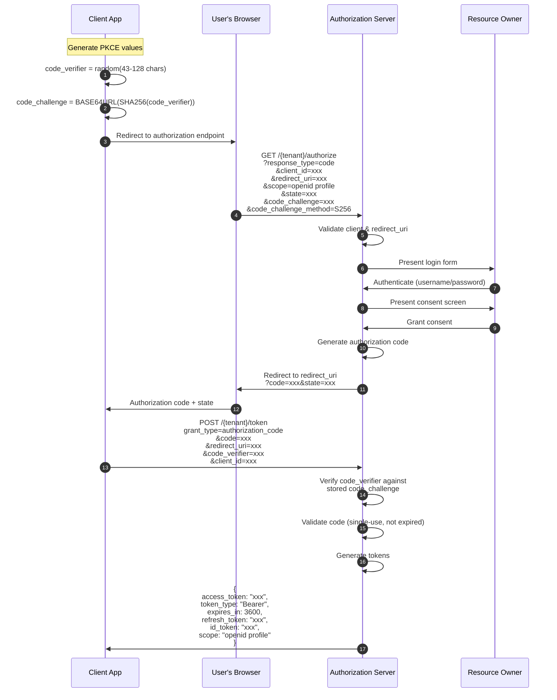

### PKCE Verification Detail

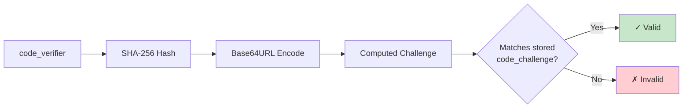

---

## Client Credentials Flow

For machine-to-machine authentication where no user context is needed.

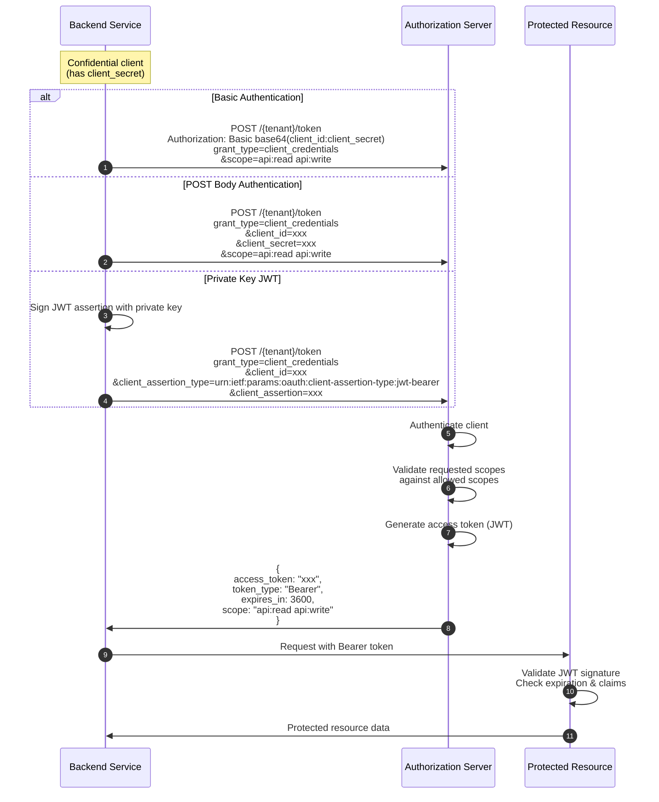

---

## Refresh Token Flow

Obtain new access tokens without user interaction. Implements rotation for security.

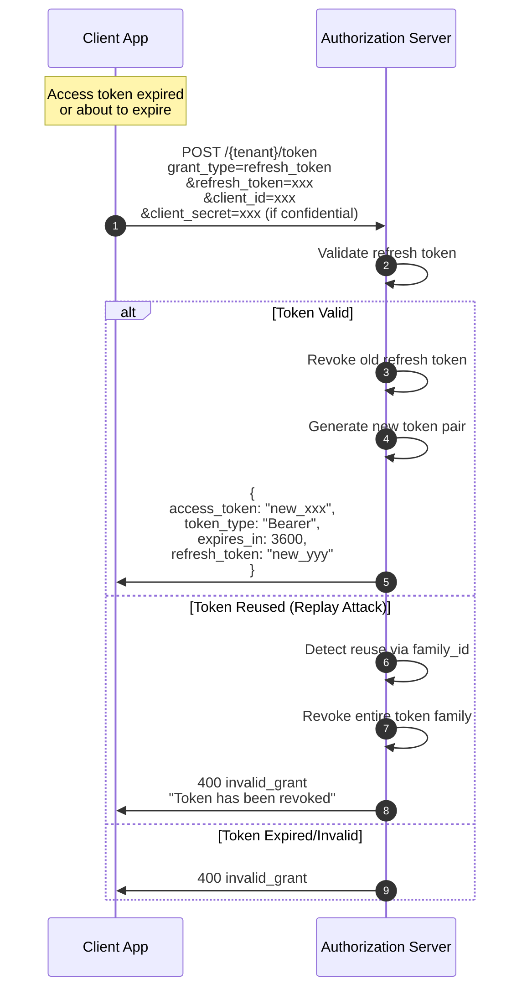

### Token Rotation & Replay Detection

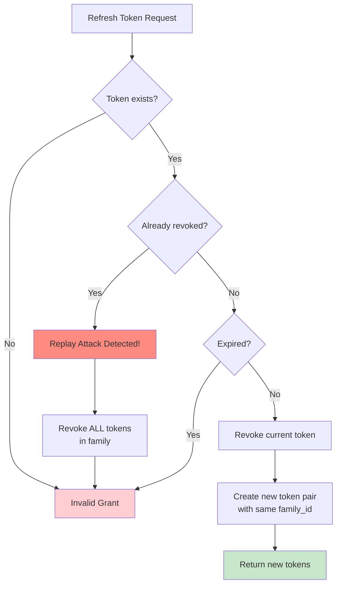

---

## Device Authorization Flow

For devices with limited input capabilities (TVs, CLI tools, IoT devices). Implements RFC 8628.

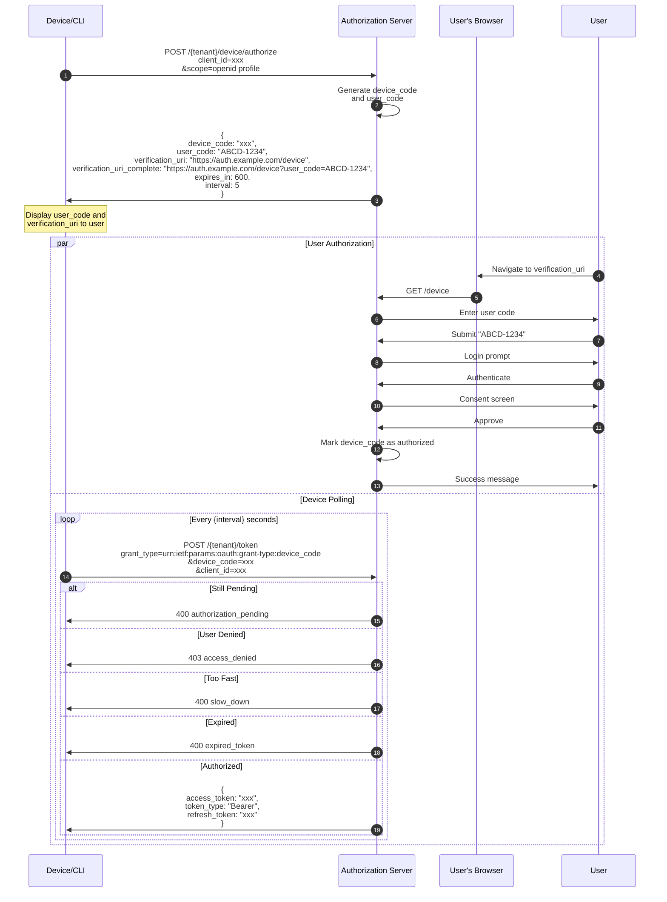

### Device Code States

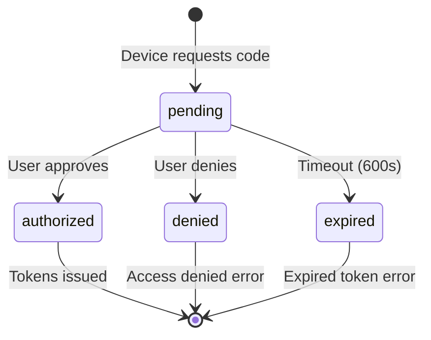

---

## Token Introspection

Allows resource servers to validate tokens and retrieve metadata. Implements RFC 7662.

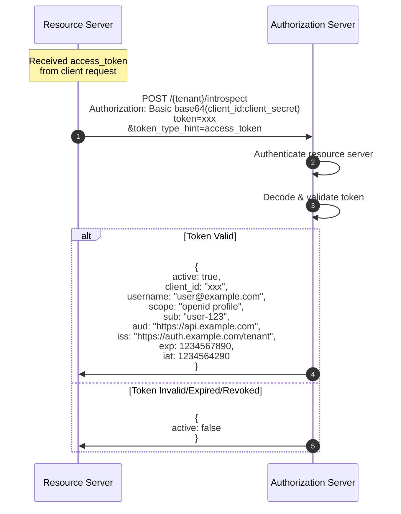

---

## Token Revocation

Allows clients to invalidate tokens. Implements RFC 7009.

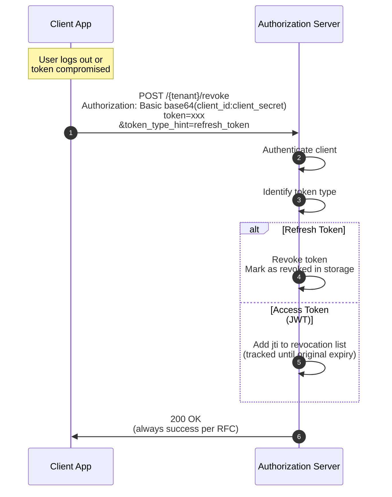

---

## Complete System Overview

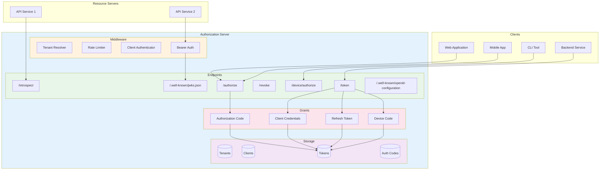

---

## Client Authentication Methods

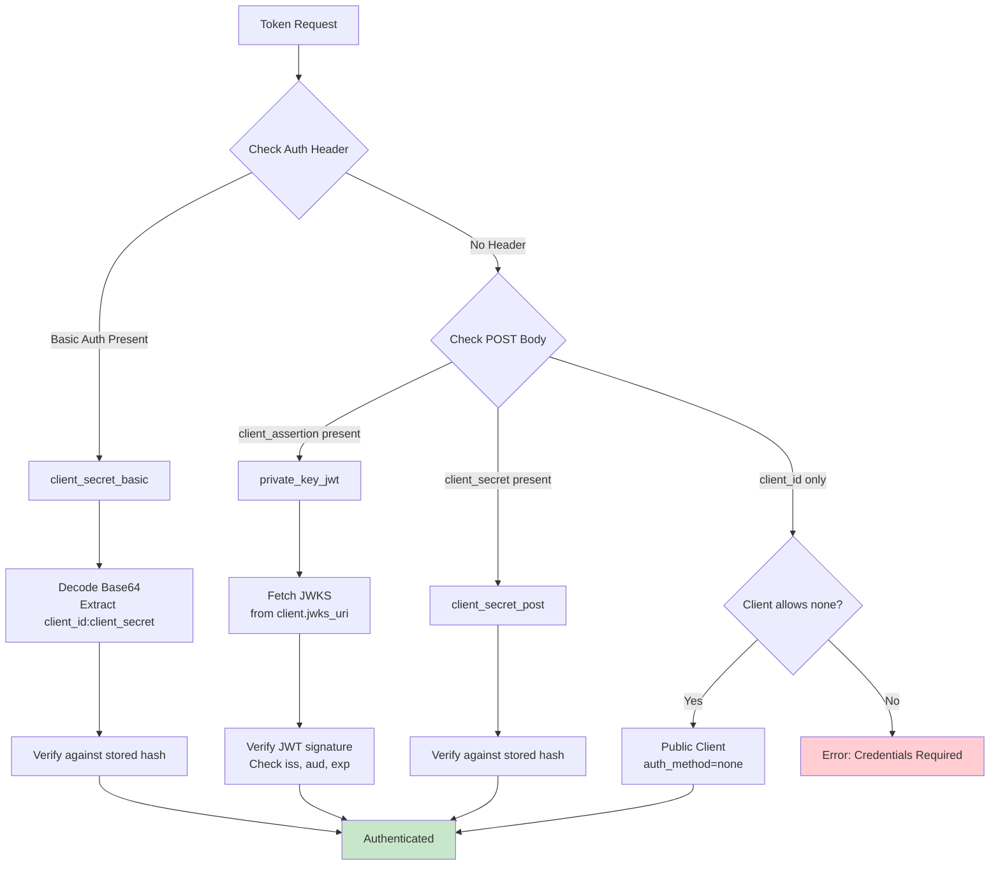

---

## JWT Access Token Structure

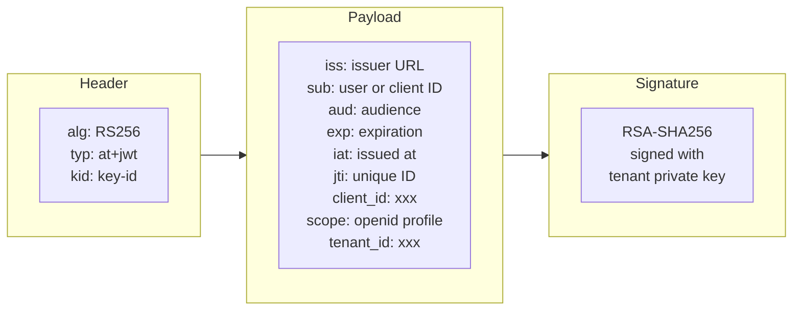

---

## Error Response Flow

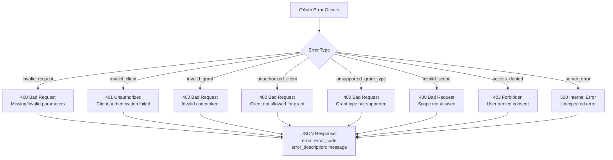
